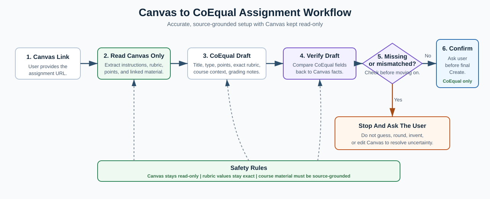

# CoEqual Assignment Creator

A portable agentic workflow for creating CoEqual assignments from Canvas assignment links while keeping Canvas strictly read-only.

This project packages a reusable workflow, Codex skill, portable prompt, and verification checklist for converting Canvas assignment/discussion pages into CoEqual assignments with exact rubric preservation, source-grounded course material, and staged QA before final creation.

To set it up on another device, copy the skill folder or use the portable workflow prompt, configure the target CoEqual course URL, sign in to Canvas and CoEqual in that device's browser, and run `\createAssignment [Canvas assignment link]`.

## At A Glance



This repository is the operating playbook for a browser-capable AI agent that prepares CoEqual assignments from Canvas links. The workflow reads Canvas only, extracts assignment requirements and rubrics exactly, uses accessible course material without inventing content, fills CoEqual, verifies every critical field, and stops before final creation until the user confirms.

## What It Does

- Extracts Canvas assignment requirements without editing Canvas.
- Converts Canvas rubric criteria into CoEqual rubric dimensions.
- Preserves rating labels, descriptions, decimals, and point values exactly.
- Creates source-grounded course material context from accessible readings.
- Writes instructor grading notes that are lenient but rubric-bound.
- Reviews CoEqual benchmark answers for unsupported claims.
- Escalates errors through the model currently running the workflow, using a structured decision contract.
- Uses a framework-neutral agentic architecture: dynamic state, guardrails, checkpoints, specialist agents, and human-in-the-loop gates.
- Applies a comprehensive error matrix and a Canvas action gate before every Canvas interaction.
- Stops before final CoEqual creation until the user confirms.
- Records a decision log and recovery artifacts for every run.

## Primary Trigger

```text
\createAssignment [Canvas assignment link]
```

For Codex accounts with the skill installed:

```text
$coequal-assignment-creator [Canvas assignment link]
```

For Claude or another browser-capable agent:

```text
Run the Canvas-to-CoEqual assignment workflow for this Canvas link: [Canvas assignment link]
Default CoEqual course: [CoEqual course URL]
Canvas must remain read-only. Stop before final CoEqual creation.
```

## Safety Promise

Canvas is always treated as read-only.

The workflow must not:

- Edit Canvas
- Save Canvas changes
- Publish or unpublish content
- Reply to discussions
- Grade or change grades
- Upload or delete Canvas files
- Change due dates, rubrics, modules, discussions, pages, assignments, or SpeedGrader

CoEqual can be prepared, but the final `Create assignment` action requires explicit user confirmation.

## Workflow Diagram

The workflow diagram is shown above under **At A Glance** and is also available as standalone source:

- [Open rendered workflow diagram](docs/workflow-diagram.svg)
- [Open editable Mermaid source](docs/workflow-diagram.mmd)

GitHub sometimes fails to render Mermaid blocks directly inside README files, so this README uses the rendered SVG image to keep the page reliable.

## Decision Levels

| Level | Meaning | Action |
|---|---|---|
| L0 | Normal path | Continue after verification. |
| L1 | Safe fallback | Continue and record the fallback. |
| L2 | User decision needed | Stop and ask. |
| L3 | Hard stop | Stop because continuing risks Canvas, grading accuracy, privacy, or source truth. |

See [docs/model-escalation.md](docs/model-escalation.md) for the model-agnostic escalation contract used by Codex, ChatGPT, Claude, or another host agent.

See [docs/agentic-architecture.md](docs/agentic-architecture.md) for the portable framework pattern and dynamic state model.

See [docs/canvas-read-only-policy.md](docs/canvas-read-only-policy.md) and [docs/comprehensive-error-handling-matrix.md](docs/comprehensive-error-handling-matrix.md) for the full safety and recovery rules.

## Stage Verification

Every run verifies:

- Canvas URL and page title
- Extracted assignment title
- Prompt and submission requirements
- Rubric criteria count
- Rating labels, descriptions, and exact point values
- Total points
- Course material source status
- CoEqual course target
- CoEqual setup field readback
- Rubric total in CoEqual
- Instructor notes
- Benchmark source grounding
- Canvas integrity

## Repository Structure

```text
.
|-- README.md
|-- config.example.json
|-- docs/
|   |-- portable-workflow.md
|   |-- verification-checklist.md
|   |-- error-handling.md
|   |-- agentic-architecture.md
|   |-- canvas-read-only-policy.md
|   |-- comprehensive-error-handling-matrix.md
|   |-- model-escalation.md
|   |-- run-state-schema.json
|   `-- failure-drills.md
`-- skills/
    `-- coequal-assignment-creator/
        |-- SKILL.md
        `-- references/
            |-- workflow.md
            |-- error-handling.md
            |-- canvas-read-only-policy.md
            |-- comprehensive-error-handling-matrix.md
            |-- failure-drills.md
            |-- run-state-schema.json
            `-- portable-transfer.md
```

## Quick Start

1. Configure the target CoEqual course URL.
2. Open or provide the Canvas assignment link.
3. Run the trigger.
4. Let the agent extract Canvas requirements and rubric read-only.
5. Let the agent prepare CoEqual.
6. Review the final QA summary.
7. Confirm only when ready to click `Create assignment`.

## Setup On Another Device

Use one of these setup paths:

- Codex skill setup: copy `skills/coequal-assignment-creator` into the target Codex account's skills folder.
- Claude/GPT portable setup: paste `docs/portable-workflow.md` into the target agent as the operating instructions.
- Shared docs setup: keep the full repo available and point the agent to `README.md`, `docs/portable-workflow.md`, `docs/error-handling.md`, and `docs/canvas-read-only-policy.md`.

Before using the workflow on the new device:

1. Open Canvas and CoEqual in the browser the agent can control.
2. Sign in manually to both systems.
3. Copy `config.example.json` to a local/private config file if the environment supports configs.
4. Replace `default_coequal_course_url` with the intended CoEqual course URL.
5. Keep `canvas_policy` as `read_only`.
6. Run `\createAssignment [Canvas assignment link]`.
7. Review the final QA summary before allowing the agent to create the CoEqual assignment.

Do not store Canvas course links, CoEqual private course IDs, student data, grades, downloads, cookies, or submissions in this repository.

## Portability

This workflow is not tied to one model, browser, account, course, or local machine. To transfer it:

- For Codex: copy `skills/coequal-assignment-creator` into the target Codex skills folder.
- For Claude or another agent: paste `docs/portable-workflow.md` as the operating prompt.
- Replace `default_coequal_course_url` in `config.example.json`.
- Keep the Canvas read-only rule and final confirmation gate unchanged.

## Core Principle

The workflow can make smart decisions when the decision does not change grading truth. If a choice affects rubric values, Canvas integrity, source fidelity, privacy, or final creation, the correct decision is to stop and ask the user.
