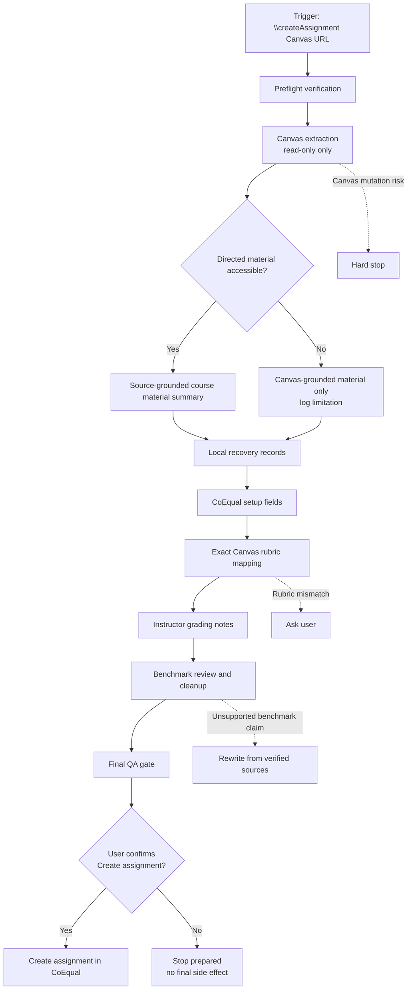

# CoEqual Assignment Creator

A portable agentic workflow for creating CoEqual assignments from Canvas assignment links while keeping Canvas strictly read-only.

This project packages a reusable workflow, Codex skill, portable prompt, and verification checklist for converting Canvas assignment/discussion pages into CoEqual assignments with exact rubric preservation, source-grounded course material, and staged QA before final creation.

## At A Glance


This repository is the operating playbook for a browser-capable AI agent that prepares CoEqual assignments from Canvas links. The workflow reads Canvas only, extracts assignment requirements and rubrics exactly, uses accessible course material without inventing content, fills CoEqual, verifies every critical field, and stops before final creation until the user confirms.

## What It Does

- Extracts Canvas assignment requirements without editing Canvas.
- Converts Canvas rubric criteria into CoEqual rubric dimensions.
- Preserves rating labels, descriptions, decimals, and point values exactly.
- Creates source-grounded course material context from accessible readings.
- Writes instructor grading notes that are lenient but rubric-bound.
- Reviews CoEqual benchmark answers for unsupported claims.
- Stops before final CoEqual creation until the user confirms.
- Records a decision log and recovery artifacts for every run.

## Primary Trigger

```text
\createAssignment [Canvas assignment link]
```

For Codex accounts with the skill installed:

```text
$coequal-assignment-creator [Canvas assignment link]
```

For Claude or another browser-capable agent:

```text
Run the Canvas-to-CoEqual assignment workflow for this Canvas link: [Canvas assignment link]
Default CoEqual course: [CoEqual course URL]
Canvas must remain read-only. Stop before final CoEqual creation.
```

## Safety Promise

Canvas is always treated as read-only.

The workflow must not:

- Edit Canvas
- Save Canvas changes
- Publish or unpublish content
- Reply to discussions
- Grade or change grades
- Upload or delete Canvas files
- Change due dates, rubrics, modules, discussions, pages, assignments, or SpeedGrader

CoEqual can be prepared, but the final `Create assignment` action requires explicit user confirmation.

## Workflow Diagram

The visual diagram above is the easiest view. The editable Mermaid source is also kept in [docs/workflow-diagram.mmd](docs/workflow-diagram.mmd).



## Decision Levels

| Level | Meaning | Action |
|---|---|---|
| L0 | Normal path | Continue after verification. |
| L1 | Safe fallback | Continue and record the fallback. |
| L2 | User decision needed | Stop and ask. |
| L3 | Hard stop | Stop because continuing risks Canvas, grading accuracy, privacy, or source truth. |

## Stage Verification

Every run verifies:

- Canvas URL and page title
- Extracted assignment title
- Prompt and submission requirements
- Rubric criteria count
- Rating labels, descriptions, and exact point values
- Total points
- Course material source status
- CoEqual course target
- CoEqual setup field readback
- Rubric total in CoEqual
- Instructor notes
- Benchmark source grounding
- Canvas integrity

## Repository Structure

```text
.
|-- README.md
|-- config.example.json
|-- docs/
|   |-- portable-workflow.md
|   |-- verification-checklist.md
|   |-- error-handling.md
|   `-- failure-drills.md
`-- skills/
    `-- coequal-assignment-creator/
        |-- SKILL.md
        `-- references/
            |-- workflow.md
            |-- error-handling.md
            |-- failure-drills.md
            `-- portable-transfer.md
```

## Quick Start

1. Configure the target CoEqual course URL.
2. Open or provide the Canvas assignment link.
3. Run the trigger.
4. Let the agent extract Canvas requirements and rubric read-only.
5. Let the agent prepare CoEqual.
6. Review the final QA summary.
7. Confirm only when ready to click `Create assignment`.

## Portability

This workflow is not tied to one model, browser, account, course, or local machine. To transfer it:

- For Codex: copy `skills/coequal-assignment-creator` into the target Codex skills folder.
- For Claude or another agent: paste `docs/portable-workflow.md` as the operating prompt.
- Replace `default_coequal_course_url` in `config.example.json`.
- Keep the Canvas read-only rule and final confirmation gate unchanged.

## Core Principle

The workflow can make smart decisions when the decision does not change grading truth. If a choice affects rubric values, Canvas integrity, source fidelity, privacy, or final creation, the correct decision is to stop and ask the user.
